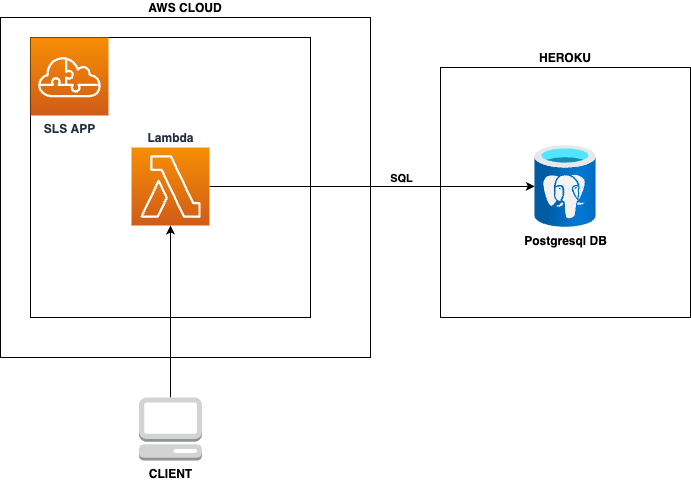
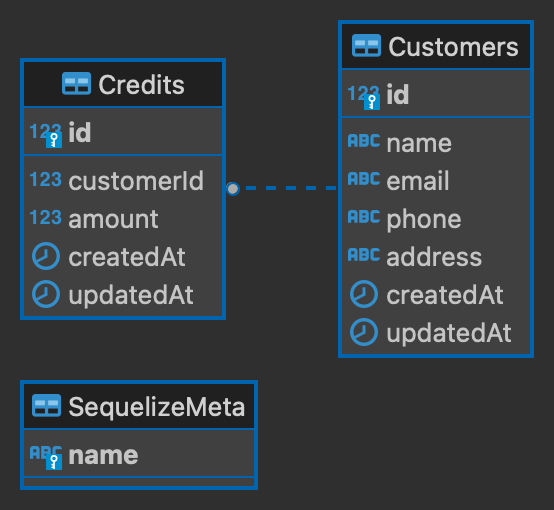

# Serverless Motorbike Shop

Serverless to manage the motorbike shop customers



## Data Base Diagram



## Endpoints

```bash
   │   GET    | https://l0cpw89yl1.execute-api.us-east-1.amazonaws.com/customers/{id}            │
   │   GET    | https://l0cpw89yl1.execute-api.us-east-1.amazonaws.com/customers                 │
   │   POST   | https://l0cpw89yl1.execute-api.us-east-1.amazonaws.com/customers                 │
   │   PUT    | https://l0cpw89yl1.execute-api.us-east-1.amazonaws.com/customers/{id}            │
   │   DELETE | https://l0cpw89yl1.execute-api.us-east-1.amazonaws.com/customers/{id}            │
   │   POST   | https://l0cpw89yl1.execute-api.us-east-1.amazonaws.com/customers/{id}/credits    │
   │   GET    | https://l0cpw89yl1.execute-api.us-east-1.amazonaws.com/customers/credits         │
   │                                                                                             │
```

Swagger Documentation (First time, up Docker)

```bash
npm run swagger:run
```

Deploy? You just have to push your code and the deploy workflows will be activated (Branch: Devel)
Bonus: Test workflow.

```bash
git push origin devel
```

## Quick Start

Install Node Version Manager [NVM](https://github.com/nvm-sh/nvm).

Install node v16

```bash
nvm install v16
nvm use v16
```

install deps

```bash
npm install
```

Run local environment with serverless offline

```bash
npm run devel
```

run tests

```bash
npm run test
npm run test:coverage
```

A collection of ready-to-deploy [Serverless Framework](https://github.com/serverless/serverless) services.

With love Pablo Toro (@pablotoro19) ⚡**️**
